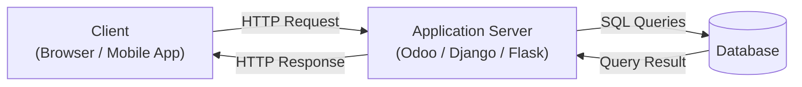
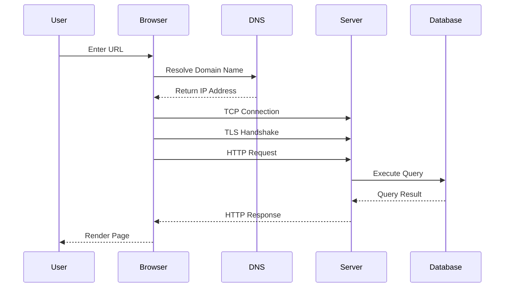
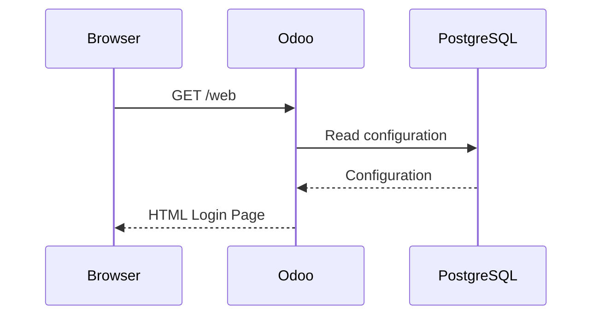

# Chapter 1 – How the Web Works

> **"Before learning authentication, authorization, sessions, JWT, or OAuth, we must first understand how a browser communicates with a server."**

---

# Learning Objectives

After completing this chapter, you will be able to:

- Explain the Client-Server architecture.
- Describe what happens after typing a URL into a browser.
- Understand the lifecycle of an HTTP request and response.
- Explain the purpose of HTTP methods and status codes.
- Understand why HTTP is stateless.
- Recognize why state management mechanisms such as Cookies, Sessions, and JWTs are necessary.

---

# Prerequisites

Before reading this chapter, you should be familiar with:

- Basic computer usage
- Using a web browser
- Basic programming concepts

No prior knowledge of networking or authentication is required.

---

# 1. Why This Chapter Exists

Imagine you open your browser and visit:

```
https://mycompany.odoo.com
```

Within a few seconds, the Odoo login page appears.

Most developers stop thinking there.

But behind the scenes, the browser, operating system, DNS servers, network routers, web server, application server, and database all work together before the login page appears.

Authentication mechanisms such as Session Authentication, JWT, OAuth2, and SSO are all built on top of this communication.

Without understanding how a browser communicates with a server, understanding authentication becomes much more difficult.

This chapter builds that foundation.

---

# 2. Client-Server Architecture

Modern web applications follow the **Client-Server Architecture**.

The client requests resources.

The server processes those requests and returns responses.



## Client

A client is software that requests services.

Examples:

- Chrome
- Firefox
- Safari
- Mobile Applications
- Postman
- cURL

The client is responsible for:

- Sending HTTP requests
- Receiving HTTP responses
- Rendering web pages
- Executing JavaScript

---

## Server

The server receives requests and processes them.

Examples:

- Odoo
- Django
- Flask
- FastAPI
- Spring Boot
- ASP.NET

Typical responsibilities include:

- Authentication
- Authorization
- Business Logic
- Database Operations
- Returning Responses

---

## Database

The database stores application data.

Examples:

- PostgreSQL
- MySQL
- Oracle
- SQL Server

The browser never communicates directly with the database.

Instead:

```
Browser
    │
    ▼
Application Server
    │
    ▼
Database
```

This architecture protects business logic and sensitive data.

---

# 3. What Happens When You Type a URL?

Suppose the user enters:

```
https://mycompany.odoo.com
```

Although it appears instantaneous, several steps occur before the page is displayed.



Let's examine each step.

---

## Step 1 – DNS Resolution

Humans remember names.

Computers communicate using IP addresses.

When you type:

```
mycompany.odoo.com
```

The browser first asks a DNS server:

> "What is the IP address of this domain?"

Example:

```
mycompany.odoo.com

↓

104.21.xxx.xxx
```

Without DNS, the browser would not know where to send the request.

---

## Step 2 – TCP Connection

Once the browser knows the IP address, it establishes a reliable network connection using TCP.

This process is called the **TCP Three-Way Handshake**.

```text
Browser                    Server

SYN ----------------------->

<------------------- SYN + ACK

ACK ----------------------->
```

After this handshake, both sides are ready to exchange data reliably.

---

## Step 3 – TLS Handshake

Because the website uses HTTPS, the communication must be encrypted.

The browser performs a TLS handshake.

During this process:

- The server presents its SSL/TLS certificate.
- The browser verifies the certificate.
- Both parties agree on encryption algorithms.
- Encryption keys are negotiated.

After the handshake completes:

```
HTTP

↓

Encrypted

↓

HTTPS
```

From this point onward, all HTTP traffic is encrypted.

---

## Step 4 – HTTP Request

Now the browser sends the actual HTTP request.

Example:

```http
GET /web HTTP/1.1
Host: mycompany.odoo.com
User-Agent: Mozilla/5.0
Accept: text/html
Accept-Language: en-US
```

An HTTP request consists of:

- Request Line
- Headers
- Optional Body

---

## Step 5 – Server Processing

The application server receives the request.

For an Odoo application, the processing pipeline is conceptually:

```text
HTTP Request

↓

Routing

↓

Authentication

↓

Authorization

↓

Business Logic

↓

Database

↓

Generate Response
```

Depending on the endpoint, Odoo may:

- Render a web page
- Execute Python code
- Read or write database records
- Return JSON
- Return a file

---

## Step 6 – Database Interaction

Suppose the request is:

```
GET /web/login
```

Odoo may query PostgreSQL for:

- Company configuration
- Installed modules
- Website configuration
- User information

The database returns the requested data.

---

## Step 7 – HTTP Response

Once processing finishes, the server sends an HTTP response.

Example:

```http
HTTP/1.1 200 OK
Content-Type: text/html
Content-Length: 15483
```

An HTTP response consists of:

- Status Line
- Headers
- Optional Body

The browser then renders the page.

---

# 4. Anatomy of an HTTP Request

An HTTP request contains four parts.

```text
Request Line

Headers

Blank Line

Body (Optional)
```

Example:

```http
POST /web/login HTTP/1.1
Host: mycompany.odoo.com
Content-Type: application/json

{
    "login": "admin",
    "password": "admin"
}
```

## Request Line

Contains:

- HTTP Method
- URL
- HTTP Version

Example:

```
POST /web/login HTTP/1.1
```

---

## Headers

Headers contain metadata.

Example:

```http
Host: mycompany.odoo.com
Content-Type: application/json
Accept: application/json
```

Headers describe the request but are not the actual business data.

---

## Body

The body contains data sent to the server.

Example:

```json
{
    "login": "admin",
    "password": "admin"
}
```

GET requests usually have no body.

POST requests usually contain one.

---

# 5. Anatomy of an HTTP Response

A response also contains four parts.

```text
Status Line

Headers

Blank Line

Body
```

Example:

```http
HTTP/1.1 200 OK
Content-Type: application/json

{
    "result":"success"
}
```

---

## Status Line

Example:

```
HTTP/1.1 200 OK
```

Contains:

- HTTP Version
- Status Code
- Status Description

---

## Headers

Examples:

```http
Content-Type: application/json
Content-Length: 321
Set-Cookie: session_id=ABC123
```

---

## Body

The body contains the actual content.

Examples:

- HTML
- JSON
- XML
- Images
- PDF
- CSV

---

# 6. Common HTTP Methods

| Method | Purpose | Safe | Idempotent | Example |
|----------|---------|------|------------|----------|
| GET | Retrieve data | Yes | Yes | View product |
| POST | Create resource | No | No | Create customer |
| PUT | Replace resource | No | Yes | Replace profile |
| PATCH | Update partially | No | No | Update email |
| DELETE | Delete resource | No | Yes | Delete record |

## GET

Used to retrieve information.

Example:

```http
GET /products
```

GET should never modify server data.

---

## POST

Used to create data.

Example:

```http
POST /customers
```

Usually contains a request body.

---

## PUT

Replaces an entire resource.

---

## PATCH

Updates only specific fields.

---

## DELETE

Removes a resource.

---

# 7. Common HTTP Status Codes

| Code | Meaning |
|-------|----------|
| 200 | OK |
| 201 | Created |
| 204 | No Content |
| 301 | Permanent Redirect |
| 302 | Temporary Redirect |
| 400 | Bad Request |
| 401 | Unauthorized |
| 403 | Forbidden |
| 404 | Not Found |
| 405 | Method Not Allowed |
| 409 | Conflict |
| 500 | Internal Server Error |
| 503 | Service Unavailable |

Understanding these codes makes debugging significantly easier.

---

# 8. Why HTTP Is Stateless

This is one of the most important concepts in this handbook.

HTTP is **stateless**.

That means:

Each request is completely independent.

Suppose you send:

```http
POST /login
```

The server authenticates you.

A few seconds later you send:

```http
GET /profile
```

How does the server know this request comes from the same user?

The answer is:

**It doesn't.**

Not automatically.

Every HTTP request is treated as a brand-new request unless additional mechanisms are introduced.

Without those mechanisms:

```
Request 1

↓

Processed

↓

Forgotten
```

```
Request 2

↓

Brand New Request
```

This limitation led to the invention of:

- Cookies
- Sessions
- JWT
- Access Tokens

These technologies add **state** on top of a stateless protocol.

They are the primary focus of the remaining chapters in this handbook.

---

# 9. Odoo Example

Suppose a user opens:

```
https://mycompany.odoo.com/web
```

A simplified request flow is:



At this stage:

- No authentication has occurred.
- No session exists.
- The server simply returns the login page.

Authentication begins only after the user submits valid credentials.

---

# 10. Behind the Scenes

When you press **Enter**, your browser performs much more than sending an HTTP request.

Internally, it:

1. Parses the URL.
2. Resolves the domain name.
3. Opens a TCP connection.
4. Negotiates TLS (HTTPS).
5. Creates an HTTP request.
6. Sends the request.
7. Waits for the response.
8. Parses HTML.
9. Downloads CSS.
10. Downloads JavaScript.
11. Downloads images.
12. Builds the DOM.
13. Applies CSS.
14. Executes JavaScript.
15. Renders the final page.

This entire process usually completes within a few hundred milliseconds.

---

# 11. Security Considerations

Although authentication has not yet been introduced, several security measures are already in place.

- HTTPS encrypts communication.
- TLS verifies the server's identity.
- The browser validates SSL certificates.
- Browsers block many unsafe cross-origin operations by default.

These protections form the foundation upon which authentication mechanisms are built.

---

# 12. Common Misconceptions

### ❌ HTTP remembers previous requests.

✅ HTTP is stateless. Every request is independent.

---

### ❌ The browser communicates directly with the database.

✅ The browser communicates only with the application server.

---

### ❌ HTTPS encrypts only passwords.

✅ HTTPS encrypts the entire HTTP request and response, including headers, cookies, and request bodies.

---

### ❌ DNS is part of HTTP.

✅ DNS is a separate service used before any HTTP communication begins.

---

# 13. Interview Questions

### Q1. What happens after typing a URL into a browser?

**Answer**

1. DNS Resolution
2. TCP Handshake
3. TLS Handshake (HTTPS)
4. HTTP Request
5. Server Processing
6. Database Interaction
7. HTTP Response
8. Browser Rendering

---

### Q2. What is the difference between HTTP and HTTPS?

**Answer**

HTTPS is HTTP running over TLS.

It provides:

- Encryption
- Server Authentication
- Data Integrity

---

### Q3. Why is HTTP called stateless?

**Answer**

Because each request is processed independently.

The server does not automatically remember previous requests.

Technologies such as Cookies, Sessions, and JWTs are used to maintain user state across multiple requests.

---

# 14. Summary

In this chapter, you learned:

- The Client-Server architecture.
- How browsers communicate with servers.
- The complete lifecycle of an HTTP request.
- The structure of HTTP requests and responses.
- Common HTTP methods and status codes.
- Why HTTP is stateless.
- Why additional state management mechanisms are required.

This foundation is essential for understanding every authentication mechanism discussed in the remaining chapters.

---

# What's Next

If HTTP forgets every request, how does a website remember that a user has already logged in?

The answer begins with two fundamental concepts:

- **Cookies**
- **Sessions**

In the next chapter, we will explore how browsers and servers work together to maintain user state across multiple HTTP requests.