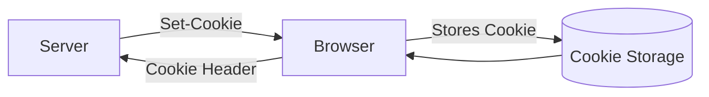
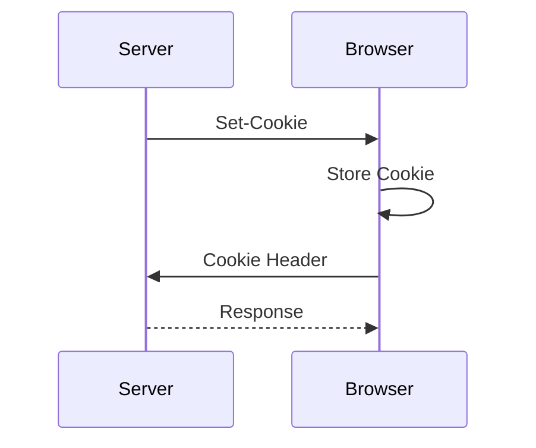
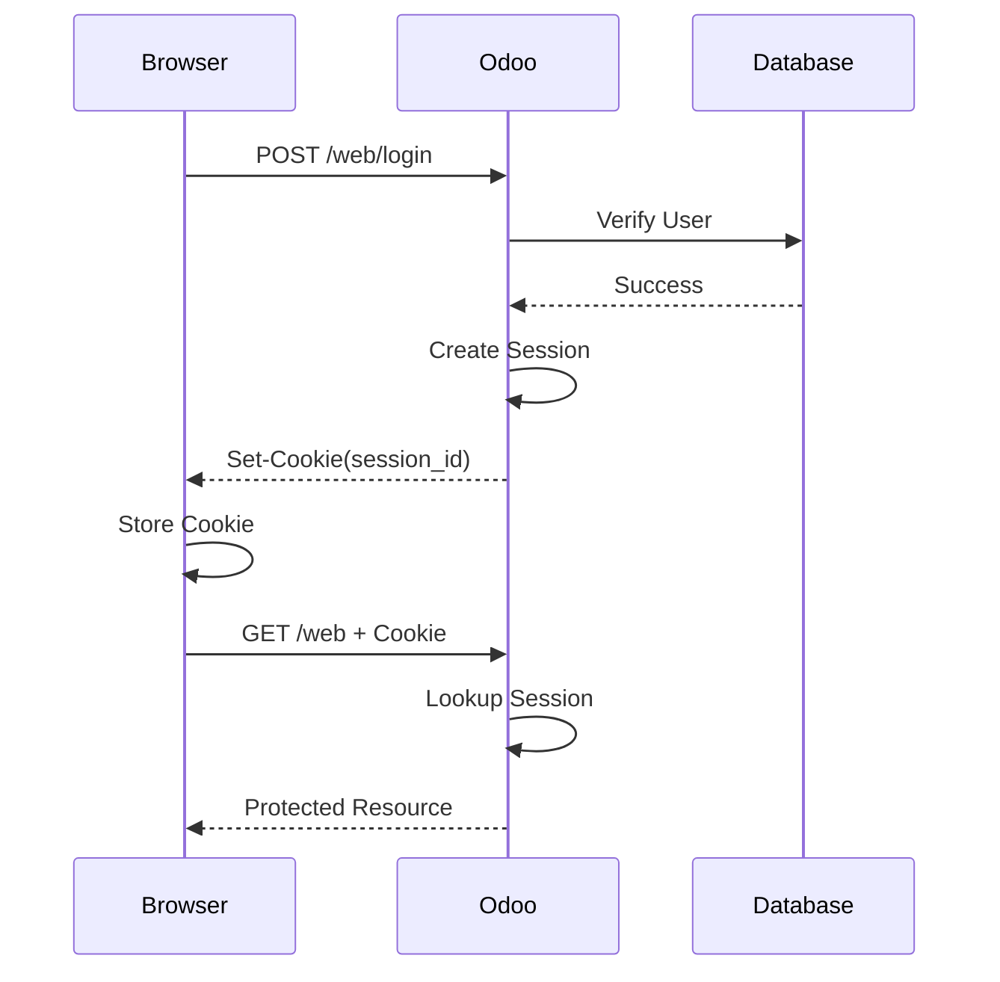

# Chapter 2 – Cookies & Sessions

> **"HTTP is stateless. Cookies and Sessions were introduced to give web applications memory."**

---

# Learning Objectives

After completing this chapter, you will be able to:

- Understand why Cookies and Sessions exist.
- Explain the difference between Cookies and Sessions.
- Describe how browsers store cookies.
- Explain how servers maintain user sessions.
- Understand the complete login flow using Session Authentication.
- Understand how Cookies and Sessions work together.
- Recognize the security risks associated with Sessions.

---

# Prerequisites

Before reading this chapter, you should understand:

- HTTP Request & Response
- HTTP Headers
- Stateless Communication

If not, read **Chapter 1 – How the Web Works** first.

---

# 1. Why This Chapter Exists

At the end of the previous chapter we learned that HTTP is **stateless**.

Consider the following scenario.

A user logs into Odoo.

```http
POST /web/login
```

The server verifies the username and password.

A few seconds later, the user opens:

```http
GET /web
```

A question immediately arises.

> **How does Odoo know that this request is from the same user?**

HTTP itself provides no answer.

Every request appears to be a completely new request.

Without additional mechanisms, users would have to enter their username and password **for every single request**.

Clearly, that is unacceptable.

To solve this problem, web applications introduced two concepts:

- Cookies
- Sessions

Together, they allow a stateless protocol to behave as though it remembers users.

---

# 2. What is a Cookie?

A **Cookie** is a small piece of data that a server asks a browser to store.

The browser automatically sends the cookie back to the same website with every future request.

A cookie is **not** a Session.

A cookie is **not** an authentication method.

A cookie is simply a storage mechanism provided by the browser.

---

## Browser Perspective



---

## Example

The server responds with:

```http
HTTP/1.1 200 OK

Set-Cookie:

session_id=ABC123XYZ;
```

The browser stores:

```
session_id=ABC123XYZ
```

Later, the browser automatically sends:

```http
GET /web

Cookie:

session_id=ABC123XYZ
```

Notice something important.

The browser sends the cookie automatically.

The application developer usually doesn't need to manually add it.

---

# 3. What Can Cookies Store?

Cookies can store almost any small text value.

Examples include:

- Session IDs
- Language Preference
- Theme Preference
- Shopping Cart Identifier
- Analytics Identifier
- JWT (sometimes)

Cookies should **never** store:

- Plain passwords
- Credit card numbers
- Sensitive personal information

---

# 4. Cookie Lifecycle



This cycle repeats for every request until the cookie expires or is deleted.

---

# 5. What is a Session?

A **Session** is data stored on the server that represents a user's authenticated state.

Unlike cookies, sessions are **not stored in the browser**.

The browser stores only the **Session ID**.

The actual session data remains on the server.

---

## Example

Suppose the server creates:

```
Session ID

↓

ABC123XYZ
```

The browser stores only:

```
ABC123XYZ
```

The server stores:

| Session ID | User | Role | Login Time |
|------------|------|------|------------|
| ABC123XYZ | admin | Administrator | 10:05 |

Notice the difference.

The browser has only the identifier.

The server has the actual information.

---

# 6. Cookie vs Session

| Cookie | Session |
|----------|---------|
| Stored in Browser | Stored on Server |
| Small text value | User data |
| Browser automatically sends it | Server looks it up |
| Can exist without authentication | Usually represents logged-in state |
| Can be deleted by browser | Controlled by server |

One of the most common interview questions is:

> **Does the Cookie contain the Session?**

No.

The cookie usually contains **only the Session ID**.

---

# 7. Complete Login Flow

Let's follow the complete process.

---

## Step 1 – User Opens Login Page

```http
GET /web/login
```

Odoo returns the login page.

---

## Step 2 – User Enters Credentials

```http
POST /web/login

login=admin

password=admin
```

---

## Step 3 – Odoo Verifies Credentials

Odoo checks:

- Username
- Password
- User Status

If valid:

Authentication succeeds.

---

## Step 4 – Session Creation

Odoo creates a new Session.

Example:

```
Session ID

↓

A8F9D71C
```

The server stores:

```
Session

↓

User ID

↓

Permissions

↓

Login Time

↓

Expiration
```

---

## Step 5 – Cookie Creation

Odoo responds:

```http
HTTP/1.1 200 OK

Set-Cookie:

session_id=A8F9D71C
```

The browser stores:

```
session_id=A8F9D71C
```

---

## Step 6 – Future Requests

The user requests:

```http
GET /web
```

The browser automatically sends:

```http
Cookie:

session_id=A8F9D71C
```

---

## Step 7 – Session Lookup

Odoo receives:

```
session_id=A8F9D71C
```

It searches:

```
Session Store

↓

Found

↓

User = Admin
```

No password is required.

---

## Complete Flow



---

# 8. Session Storage

Where are sessions stored?

That depends on the application.

Common options include:

- Memory
- Redis
- Database
- Filesystem

For small applications:

```
Application Memory
```

For production systems:

```
Redis
```

is a common choice because it is fast and supports multiple application servers.

---

# 9. Cookie Attributes

Cookies contain additional attributes that improve security.

Example:

```http
Set-Cookie:

session_id=A8F9D71C;

HttpOnly;

Secure;

SameSite=Lax;

Max-Age=3600;
```

---

## HttpOnly

Prevents JavaScript from reading the cookie.

Protects against many XSS attacks.

---

## Secure

Cookie is sent only over HTTPS.

Never over HTTP.

---

## SameSite

Controls when browsers send cookies during cross-site requests.

Common values:

- Strict
- Lax
- None

This attribute helps reduce CSRF attacks.

We will study this in detail in Chapter 8.

---

## Max-Age / Expires

Determines when the cookie expires.

After expiration, the browser removes it.

---

# 10. Session Expiration

Sessions should not live forever.

Common expiration policies:

- 30 minutes of inactivity
- Logout
- Browser close
- Fixed expiration time

Expired sessions reduce the impact of stolen Session IDs.

---

# 11. Odoo Example

Standard Odoo web authentication uses **Session Authentication**.

The browser stores a cookie containing the Session ID.

Every future request automatically includes that cookie.

Internally, Odoo retrieves the session associated with the Session ID and identifies the logged-in user.

As developers, we often access information such as:

```python
request.session

request.uid

request.env.user
```

These objects are available because Odoo has already identified the user through the Session.

---

# 12. Behind the Scenes

A common misconception is:

> "The browser logs me in."

Actually:

```
Browser

↓

Stores Session ID

↓

Sends Session ID

↓

Server identifies user
```

The browser never knows:

- Your permissions
- Your roles
- Your session data

It merely stores an identifier.

The server does all the work.

---

# 13. Security Considerations

Although Session Authentication is secure, several risks exist.

## Session Hijacking

If an attacker steals a Session ID:

```
session_id=A8F9D71C
```

they may impersonate the user.

Mitigations:

- HTTPS
- HttpOnly
- Secure Cookies
- Short Session Lifetime

---

## Session Fixation

An attacker forces a victim to use a known Session ID.

Mitigation:

Generate a new Session ID immediately after successful login.

---

## CSRF

Because browsers automatically send cookies, attackers may trick users into making unwanted requests.

This is why Session Authentication usually requires CSRF protection.

Chapter 8 is dedicated entirely to this topic.

---

# 14. Common Misconceptions

### ❌ Cookie and Session are the same.

✅ A Cookie stores data in the browser.

A Session stores data on the server.

---

### ❌ The Cookie contains all user information.

✅ Usually it contains only a Session ID.

---

### ❌ The browser authenticates the user.

✅ The browser merely sends the Session ID.

The server authenticates the user by looking up the Session.

---

### ❌ Cookies are only for authentication.

✅ Cookies can store many types of information, such as language preferences, shopping cart IDs, or analytics identifiers.

---

# 15. Interview Questions

## Q1. What is the difference between a Cookie and a Session?

**Answer**

A Cookie is client-side storage managed by the browser.

A Session is server-side storage managed by the application.

The Cookie typically stores only a Session ID, while the Session contains user-specific information.

---

## Q2. Why do Session-based applications need Cookies?

**Answer**

HTTP is stateless.

The Cookie carries the Session ID with every request, allowing the server to locate the correct Session.

---

## Q3. What information is stored in the browser during Session Authentication?

**Answer**

Typically only the Session ID.

Sensitive information remains on the server.

---

## Q4. Why is HttpOnly important?

**Answer**

It prevents JavaScript from reading cookies, reducing the risk of cookie theft through XSS attacks.

---

# 16. Summary

In this chapter, you learned:

- Why Cookies exist.
- Why Sessions exist.
- The difference between Cookies and Sessions.
- How Session Authentication works.
- How browsers automatically send Cookies.
- How servers identify users through Session IDs.
- Common cookie attributes.
- Security risks associated with Session Authentication.

Cookies provide a way for browsers to remember information.

Sessions provide a way for servers to remember authenticated users.

Together, they make stateless HTTP behave like a stateful protocol.

---

# What's Next

So far we have discussed how a web application remembers a user.

The next question is equally important:

> **How do we verify who the user actually is?**

In the next chapter, we will distinguish two concepts that are often confused:

- **Authentication**
- **Authorization**