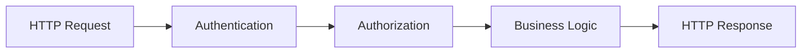

# Chapter 3 – Authentication vs Authorization

> **"Authentication answers 'Who are you?' while Authorization answers 'What are you allowed to do?' These are two different security concepts that work together in every modern application."**

---

# Learning Objectives

After completing this chapter, you will be able to:

- Define Authentication and Authorization.
- Explain the difference between Authentication and Authorization.
- Understand how they work together.
- Identify where Authentication and Authorization occur in a request lifecycle.
- Understand how Odoo implements both concepts.
- Answer common interview questions confidently.

---

# Prerequisites

Before reading this chapter, you should understand:

- HTTP Request & Response
- Cookies & Sessions
- Stateless Communication

---

# 1. Why This Chapter Exists

Developers often use the terms **Authentication** and **Authorization** interchangeably.

For example, someone might say:

> "The user is authorized."

When they actually mean:

> "The user is authenticated."

Although they sound similar, they solve two completely different problems.

Understanding this distinction is fundamental because every authentication mechanism discussed later in this handbook—Basic Authentication, Session Authentication, JWT, OAuth2, and SSO—depends on these two concepts.

---

# 2. Authentication

Authentication answers one simple question:

> **Who are you?**

The server verifies the identity of the user.

Examples of credentials include:

- Username & Password
- Fingerprint
- Face Recognition
- OTP
- Smart Card
- JWT
- Session ID
- API Key (for applications)

Authentication does **not** determine what the user is allowed to do.

It only verifies identity.

---

## Real Example

You arrive at your office.

The security guard asks:

> "Please show your employee ID."

You present your employee card.

The guard verifies:

- Your photo
- Your employee ID
- Your identity

The guard now knows:

```
You are Shamim.
```

This is **Authentication**.

---

# 3. Authorization

Authorization answers another question.

> **What are you allowed to do?**

Once the system knows who you are, it determines what actions you are permitted to perform.

Authorization is based on:

- Roles
- Permissions
- Policies
- Access Rules

Examples:

```
Admin

↓

Can create users
```

```
Manager

↓

Can approve leave
```

```
Employee

↓

Can view own profile
```

---

## Real Example

After entering your office building:

You attempt to enter the Server Room.

The access control system checks:

```
Role = Software Engineer
```

Server Room requires:

```
Role = Infrastructure Team
```

Access denied.

Notice:

The company knows exactly who you are.

But you still cannot enter.

This is Authorization.

---

# 4. Authentication vs Authorization

| Authentication | Authorization |
|---------------|---------------|
| Verifies identity | Verifies permissions |
| Answers "Who are you?" | Answers "What are you allowed to do?" |
| Happens first | Happens after Authentication |
| Uses credentials | Uses roles and permissions |
| Login process | Access control process |

---

# 5. Request Lifecycle

Authentication and Authorization occur at different stages.



If Authentication fails:

```
Request

↓

Authentication

↓

Failed

↓

401 Unauthorized
```

Business logic never executes.

If Authentication succeeds but Authorization fails:

```
Request

↓

Authentication

↓

Success

↓

Authorization

↓

Failed

↓

403 Forbidden
```

---

# 6. Authentication Flow

Suppose a user submits:

```http
POST /web/login

login=admin

password=admin
```

The server checks:

- Username
- Password
- Account Status

If everything is valid:

```
Identity Verified

↓

Authenticated
```

The server now knows:

```
User = Admin
```

---

# 7. Authorization Flow

The authenticated user requests:

```http
DELETE /users/15
```

The server checks:

```
Role

↓

Administrator?
```

If yes:

```
Delete User
```

Otherwise:

```
403 Forbidden
```

---

# 8. Authentication Without Authorization

A user logs into Odoo successfully.

Authentication succeeds.

However:

The user attempts to access Accounting.

Odoo checks:

```
Accounting Manager Group?
```

No.

Access denied.

The user is authenticated.

The user is **not authorized**.

---

# 9. Authorization Without Authentication

Can Authorization happen before Authentication?

No.

Suppose someone sends:

```http
DELETE /users/5
```

The server first asks:

```
Who are you?
```

If the identity cannot be determined,

there is no point checking permissions.

Authentication must always happen first.

---

# 10. Common Authentication Methods

Examples include:

- Basic Authentication
- Digest Authentication
- Session Authentication
- JWT Authentication
- OAuth Login
- SSO Login

Notice that these methods verify identity.

They do not decide permissions.

---

# 11. Common Authorization Models

Authorization can be implemented in many ways.

Examples:

## Role-Based Access Control (RBAC)

Permissions are assigned to roles.

Example:

```
Administrator

↓

Read

Create

Update

Delete
```

---

## Permission-Based

Permissions are assigned individually.

Example:

```
User

↓

Can Create Invoice

Cannot Delete Invoice
```

---

## Attribute-Based Access Control (ABAC)

Authorization depends on attributes.

Examples:

- Department
- Country
- Time
- Device
- IP Address

---

# 12. Odoo Example

Odoo performs Authentication during login.

Example:

```http
POST /web/login
```

After successful login,

Odoo creates a Session.

For every future request,

Odoo identifies the user using the Session.

Once the user is identified,

Odoo checks:

- Groups
- Access Rights
- Record Rules

Examples:

```
Sales User

↓

Can View Quotations
```

```
Sales Manager

↓

Can Confirm Sales Orders
```

```
Administrator

↓

Can Access Settings
```

Authentication identifies the user.

Authorization determines what menus, models, records, and actions that user can access.

---

# 13. Behind the Scenes

Consider this request.

```http
GET /web
```

Internally, Odoo performs something conceptually similar to:

```text
Receive Request

↓

Read Session

↓

Identify User

↓

Load Groups

↓

Check Permissions

↓

Execute Controller

↓

Generate Response
```

Notice that permission checks happen **after** user identification.

---

# 14. Security Considerations

Authentication and Authorization protect different aspects of an application.

Authentication prevents:

- Impersonation
- Unauthorized login

Authorization prevents:

- Privilege escalation
- Unauthorized access to resources

Even if Authentication is perfect,

poor Authorization can expose sensitive data.

Likewise,

strong Authorization is meaningless if anyone can bypass Authentication.

Both are equally important.

---

# 15. Common Misconceptions

### ❌ Authentication and Authorization are the same.

✅ Authentication verifies identity.

Authorization verifies permissions.

---

### ❌ Login means the user can access everything.

✅ Login only proves identity.

Permissions determine what the user can access.

---

### ❌ Authorization happens before Authentication.

✅ Authentication must happen first.

Only then can the server evaluate permissions.

---

### ❌ JWT performs Authorization.

✅ JWT is primarily an Authentication mechanism.

Authorization is implemented by the application using roles, permissions, claims, or policies.

---

# 16. Interview Questions

## Q1. What is Authentication?

**Answer**

Authentication is the process of verifying the identity of a user or application.

It answers:

> "Who are you?"

---

## Q2. What is Authorization?

**Answer**

Authorization determines what an authenticated user is allowed to access or perform.

It answers:

> "What are you allowed to do?"

---

## Q3. Which happens first?

**Answer**

Authentication always happens before Authorization.

The system must know who the user is before deciding what the user can access.

---

## Q4. Can a user be authenticated but not authorized?

**Answer**

Yes.

Example:

A Sales User successfully logs into Odoo but attempts to access the Accounting module.

Authentication succeeds.

Authorization fails.

---

## Q5. Which HTTP status codes are commonly associated with Authentication and Authorization failures?

| Status Code | Meaning |
|-------------|---------|
| 401 Unauthorized | Authentication failed or credentials missing. |
| 403 Forbidden | Authentication succeeded, but the user lacks permission. |

---

# 17. Summary

In this chapter, you learned:

- Authentication verifies identity.
- Authorization verifies permissions.
- Authentication always occurs before Authorization.
- A user may be authenticated but still not be authorized.
- Odoo authenticates users during login and authorizes them using groups, access rights, and record rules.

Authentication answers:

> **Who are you?**

Authorization answers:

> **What are you allowed to do?**

Both concepts work together to secure modern web applications.

---

# What's Next

Now that you understand the difference between Authentication and Authorization, we are ready to explore the first authentication mechanism.

In the next chapter, we will study **Basic Authentication**, understand how it works at the HTTP protocol level, why it is considered insecure without HTTPS, and why it is rarely used in modern production applications.